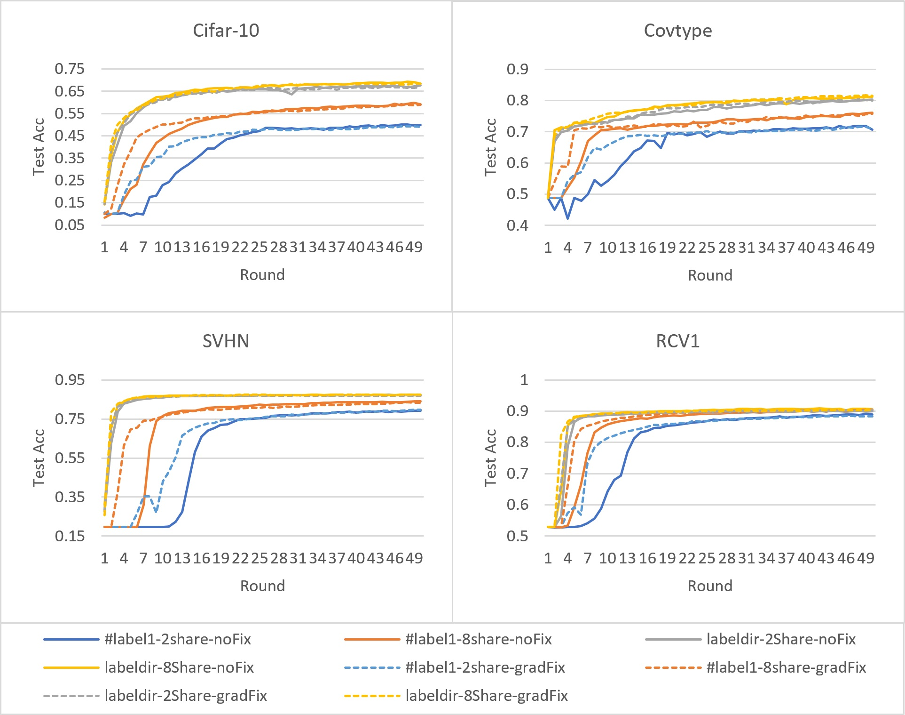
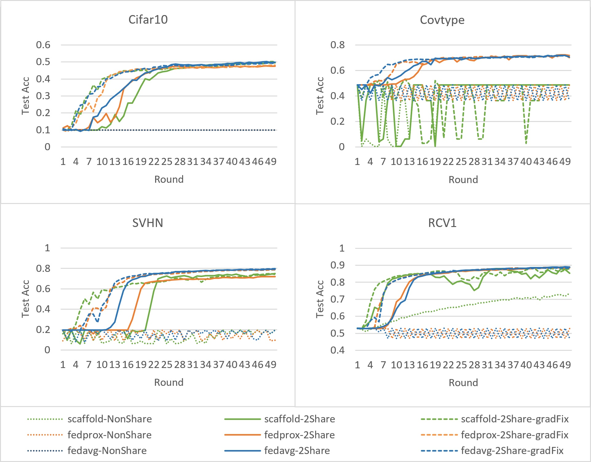

# A Gradient Correction-Based Training Acceleration Method Using Shared Data in Partial Data-Silos Scenario

This repository is the official implementation of: A Gradient Correction-Based Training Acceleration Method Using Shared Data in Partial Data-Silos Scenario. 

The provided source code addresses the slow-start phenomenon in partial data island scenarios by proposing an approach that constructs approximate IID datasets as gradient anchors from shared data. It leverages a dynamic augmentation mechanism to rectify gradient directions during early training stages, and employs a linear decay strategy to balance convergence speed with generalization performance. Experiments conducted across four types of datasets, three aggregation algorithms, and multi-dimensional Non-IID scenarios demonstrate that this method effectively mitigates the slow-start problem arising from extreme Non-IID data distributions in limited data island environments. Furthermore, the method exhibits general applicability across various aggregation algorithms.

This source code is adapted from the original implementation of the paper [Federated Learning on Non-IID Data Silos: An Experimental Study](https://arxiv.org/pdf/2102.02079.pdf). The original source code can be found [here](https://github.com/Xtra-Computing/NIID-Bench).

## Experimental environment

CPU: Ryzen R9 7950x

GPU: RTX 4080 super

OS: Windows11 22H2

Memory: 64G DDR5 6000mhz

Python: 3.11.9

CUDA: 12.4

Pytorch: 2.4.0+cu124

CUDNN: 9.0.1

## Requirements

Please use the following command to install the dependent environment:

```setup
pip3 install torch torchvision torchaudio --index-url https://download.pytorch.org/whl/cu124
pip3 install matplotlib numba pandas psutil scikit-learn seaborn tqdm requests scipy
```

This source code uses four datasets, which are: CIFAR-10, SVHN, RCV1, and Covertype respectively. For RCV1 and Covtype, you need to use the svmlight format. You can download the dataset and convert it yourself, or click [here](https://www.hostize.com/v/6RMnkuQFhG) to download all the converted datasets.

## Usage

After installing the development environment and preparing the dataset, you can respectively use the following commands to run experiments with Fedavg, Fedprox and Scaffold as aggregation algorithms

```train
python3 experiments_fedavg.py
python3 experiments_fedprox.py
python3 experiments_scaffold.py
```

The experimental parameters can be adjusted in individual files.

## Results

 In the figure, “2Share” denotes sharing 2 raw samples per participant per aggregation round, while “8Share” denotes 8. For Non-IID scenarios, “\#label1” refers to the extreme case where each participant holds data from only one class, and “labeldir” uses a Dirichlet split with $\alpha=0.5$. Under “noFix,” the proposed gradient-correction (Algorithm 1) is disabled ($iidE\equiv0$); under “gradFix,” it is enabled with $\mu=15$ and $\sigma=2$.

The experiments using the **Fedavg** aggregation algorithm are as follows:

<br/>

The experiments using **FedProx** and **Scaffold** aggregation algorithms are as follows:

<br/>

